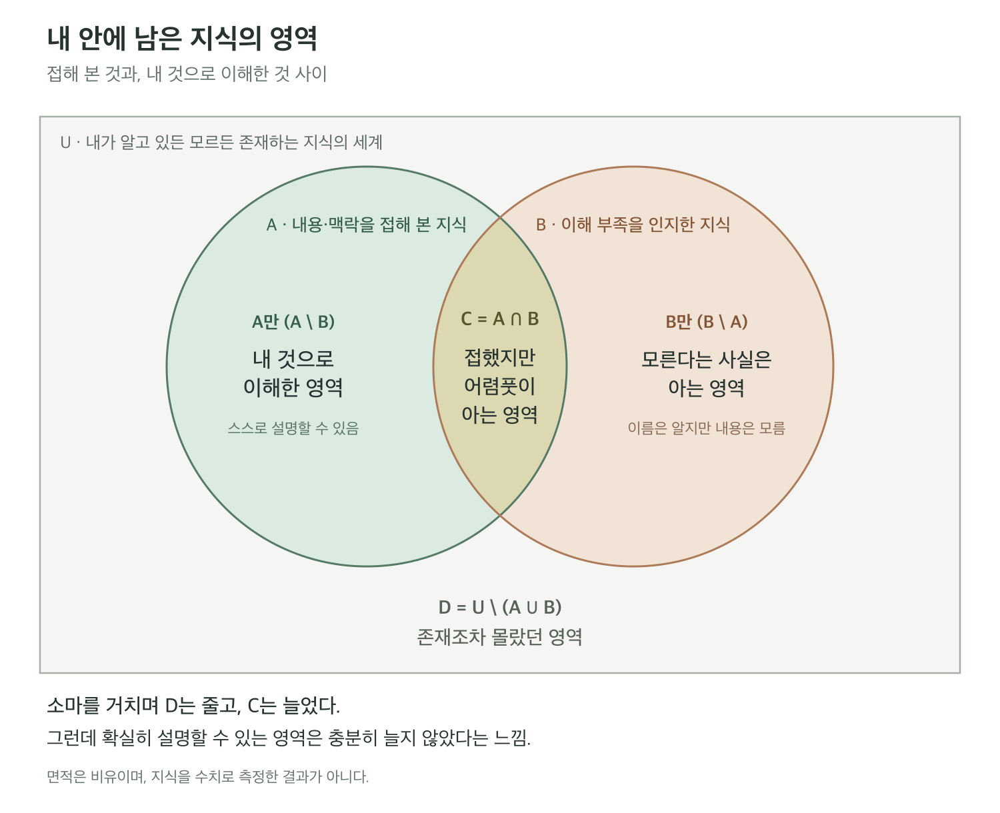

> 이 글은 AI·SW마에스트로 제17기 과정을 진행하면서 들었던 생각을 정리하고자, 다음의 Raw Prompt를 OpenAI Dots에게 던져서 나온 초안을 사람이 일부 수정한 결과물입니다.

Raw Prompt

소마 본과정 막바지 회고(2026년 6월부터 지금까지) 글을 작성하고 싶음. 다음 draft로부터 완성된 글을 작성해줘.

- 생산한 건 많은데 정작 내가 얻은 게 뭔가? 하면 명확하게 떨어지는 답을 내놓기가 쉽지 않음. 솔직히 최근까지만 해도 거의 Meat Proxy에 가깝게 역할을 수행했다고 느낌.
- 개인으로서 얻은 게 아예 없지는 않음. 실제 팀 프로젝트 협업 경험과 일정 관리, 우선순위 판단, 비즈니스적 가치 판단과 같은 경험을 한 번이라도 해 본 사람과 그냥 대학생은 다르지. 또 X처럼 최신 SW/AI 기술 트렌드/동향이나 개발업계에서의 social한 무언가/지식을 얻는 source와 방법을 알게 되었으며 그것들을 일상적으로 체크하는 습관이 몸에 배였다든가. 개발업계에서 밋업/발표 등이 어떻게 진행되는지 얼추 파악하고 비록 아직 스피커로서 나가는 건 무리더라도 '참가할 용기' 정도는 생겼다든가. 가장 중요한 건 에이전틱 코딩의 구성요소, 개념, AI를 활용한 워크플로우 등에 익숙해진 것. 또 SW 영역에서 '내가 모르는 영역'의 용어, 개념들을 알거나, 또는 적어도 '모른다는 사실을 알게' 되었음. 집합이 2개인 벤 다이어그램에서 내가 아는 영역을 A, 모르는 영역을 B, '들어본 적 있지만 확실히 알지는 못하는' 영역은 A와 B의 교집합 C, 아예 상상조차 할 수 없는 그 외의 영역을 전체집합 U에서의 여집합 D라고 하면, D가 차지하는 영역이 조금 줄어든 것도 성과라면 성과라고나 할까. 이런 것들은 그냥 대학생1, 그것도 컴공도 아닌 공대생1로만 남아 있었다면 절대 얻지/익숙해지지 못했을 경험들임.
- 문제는 B가 줄어들고 C는 늘어나는데 정작 A의 영역을 늘리지는 못한다는 것. 이건 사실 예전부터 있어왔던 안 좋은 습관인데, 전체 청사진에서 그게 어떤 건지 대략적으로만 맥락을 파악하면 구체적인 개념은 나중에 진짜 그 개념이 필요할 때 찾아보면 되지 않을까(AI가 등장한 이후로는 구체적인 작업은 AI가 해주니 충분하지 않은가) 라는 생각으로 넘기게 된 것. 한 번 넘기면 결국 잊어버림. 임시 공간에 raw 파일을 저장해 놓는다고 해도 그것을 다시 보지 않음(예: 북마크해둔 개발 트윗들은 영원히 다시 보지 않는다는 슬픈 이야기). 결국 온전한 내 것, 기계들의 시대에 인간 개발자로서 차별화될 수 있는 온전한 역량은 만들어지지 않음.
- 직접 개발하지 않고 전체 맥락을 지휘하는 전통적인 역할로서의 PM/PO라면 그걸로 충분했을지도 모름. 하지만 AI가 등장하면서 '인간이 필요한 이유'를 질문하는 시대에, 그걸로 정말 충분한가? AI가 해주기만 하고 그 추상화 레벨 아래에서 무엇이 동작하지도 모르는 개발자를 고용할 이유가 뭐가 있지? 빌더가 아니라 개발자로 남을 수 있는 역량을 나는 지니고 있는가? 또는 적어도 만들어가고 있는가?
- 최근에 본 인상적인 트윗이 있는데, '좋은 기술은 복잡성을 사용자에게 강요하지 않는다. 그렇다고 복잡성이 존재하지 않는 것은 아니다. Abstraction hides complexity. It doesn't eliminate it.' 나 또한 이 말에 동의함. 적어도 결과물만 아는 사람과 내부적으로 돌아가는 과정이 있다는 사실을 아는 사람, 그 과정을 이해하고 비판적으로 사고하고 스스로 발전/최적화시킬 수 있는 사람이 나뉘는 것은 AI 이전이나 이후나 통용되는 현상인 것 같음. 물론 나는 엄밀히 따지자면 AI Native 시대의 개발자에 가깝지만ㅋ
- 게다가 일정이 너무 바쁘면 그 '대략적'인 맥락조차 파악하지 않고 넘어가는 경우가 비일비재했음. 가령 같은 원인에서 비롯한 리뷰 지적이 매번 동일하게 들어오는데도 나는 그 사실을 알지조차 못하고 넘어가니 배우는 게 없고, 결과적으로는 나뿐만 아니라 팀 전체의 리소스 낭비로 이어지게 됨.
- 나만의 워크플로우(요구사항정의-스펙-구현-테스트-리뷰핑퐁)를 구체화하고 각각의 단계에 맞는 스킬/플러그인을 구축하는 정도는 해 봤지. AI한테 만들어달라고 하면 되니까. 모델이 업데이트되거나 호환성이 안 맞거나 다른 문제가 생기거나 팀 규칙이 바뀌는 데에 그때그때 대응하면서 수정해야 하기는 하지만. 사실 이것도 어떤 구체적인 지표나 테스트로 측정한 다음 바꾸어야 하는지 유지해도 되는지 판단하는 도구를 만들고 싶긴 한데, 귀찮고 토큰 모자라서 안 하고 있음.
- 문제는 이것도 '해줘'랑 다를 게 없다는 것임. 특히 리뷰 핑퐁 단계에서 그런 점이 도드라지는데, 상대방이 이런 저런 것들을 지적해서 바꿔주세요 하면 나는 리뷰 스킬 써서 해결해 프롬프트만 넣고 대응을 끝내버리니 이게 어떤 문제였더라? 하고 인간이 물어보면 그런 문제가 있었어요? 라고밖에 대답할 수 없는 것... 나는 지금 우리 코드가 어떻게 구성되어 있는지조차 모름. 인간이 구조를 짜고 세부 코드를 구현하고 하는 게 아니고, 일단 선 AI 구현 후 인간이 리버싱/역공학을 하는 느낌인데. 그것도 인간이 직접 하나하나 뜯어보기에는 너무 방대해서 AI야 우리 코드베이스 분석해줘 일일이 명령하고 뜯어봐야 하는 것임. 게다가 최근에는 그것도 할 시간이 없음. 내가 다른 팀원들이 어떤 일들을 하는지도 초반에야 직접 물어보거나 올라오는 PR 다 훑어보거나 하는 방식으로 겨우겨우 따라갔다면 요즘에는 뭐가 바뀌는지도 잘 모르고 있음. 당장 내가 어떤 일을 하는지도 모르는 마당에. 아니지 내 AI가 뭘 하는지라고 해야겠네.
- 뭐 어차피 앞으로는 AI가 모든 걸 해줄 거다 그런 거 배울 필요없다 이런 말도 들려오기는 하는데... 적어도 아직까지 제로샷/원샷으로 모든 걸 해결하기는 불가능한 것 같고. 어제 본 공감되는 트윗 하나 더: '코딩 에이전트가 일을 잘한다고 느껴진다면 그건 아마도 만들고 있는 것이 이미 시장에서 성숙한 아이템일 확률이 높다는 의미일 듯'
- 아무튼 결과적으로 나는 본과정 6-9월, 즉 4개월여의 기간 동안 거의 성장하지 못했다고 느꼈다는 사실이 이 글을 쓰고 있는 이유임.
- 사실 이런 위기감을 느끼고는 있었지만 너무 바빠서 등의 핑계로 진지하게 / retrospective하게 돌아보고 대안을 내놓지 못했음. 정확히는 한 중간쯤부터 그래야 한다는 필요성을 느끼기는 했는데, 정확히 어떤 점이 문제인지조차 파악할 수가 없어서 어떻게 해야 할지 갈팡질팡했던 것 같음. 총체적 난국 상황인 건 알겠는데 그래서 내가 뭘 해야 하지? 바빠 죽겠는데 에라 모르겠다 일단 결과물이 나오고 있으니까~ 같은 느낌. 다른 팀원들은 일하는데 나도 그 속도에 맞춰서 따라가려면 곰곰이 생각해 보고 고민해 보고 질문해 보기보다는 그냥 빠르게 AI 돌려서 따라가야 한다는 의무감도 강했던 것 같고.
- 우울함과 무기력함이 오래 이어지면 결국 아무 생각도 안 하게 되는데(tmi: 이런 상황을 재수할 때 겪어봤는데 다시는 겪고 싶지 않다...), 그것과 이것이 약간 비슷하다는 생각을 했음. 이번에는 우울하기보다는 너무 오래 AI와 작업하면서 일종의 인지적 항복 상태에 접어들고, 실제 생활에서도 오래 고민하지 못하게 된 것에 더 가까운 것 같음.
- 사실 위에 적은 내용은 다 핑계에 가깝고 우리 팀원뿐만 아니라 소마 사람들은 다 그러면서도 AI 잘 쓰면서도 공학자로서의 태도 책임 잘 지키고 있더라. 어떤 상황에 부닥쳤을 때 AI한테 던져서 '해 줘'하는 게 아니고 질문을 던지고, 어떤 게 더 나은 방법인지 고민해보고, 그 과정에서 스스로의 판단력과 비판적 사고력과 어쩌구...를 성장시키고 있는데 나만 안 함 이건 어쨌든 내 문제고 내 잘못이겠지요... 트윗+1 : 'AI가 잘 아니까 사람은 공부할 필요가 없다고 생각하시는 분들은 안 하셔도 됩니다. 그러나 기억하시기 바랍니다. 지식이 통찰을 보장하지는 않지만, 지식 없는 통찰은 존재하지 않습니다. 통찰은 적어도 한 분야에서 전문가 수준에 오른 후에나 가질 수 있는 능력입니다.'
- 아무튼 오늘은 TOPCIT 공부하다 보니까 너무 오랜만에 이런 종류의... 그러니까 '공부'를 하게 되었고, 오래 집중하고 생각할 수 있는 시간이 마련됐고, 그러다 보니까 생각이 연쇄적으로 이어져서 작금의 내 상황을 보다 오래 돌이켜보고 판단을 내릴 수 있는 기회가 되었음. 그간 속마음이랑 고민을 머리 속에 담아두기만 했지 털어놓거나 발산하거나 하진 않았는데.
- 안 바쁘냐? 사실 그렇지는 않음 지금이 제일 발등튀김이고 사실 오늘도 탑싯 공부를 하기보다는 남은 한 달밖에 안 되는 기간 동안에 어떻게 마케팅이랑 남은 기능 개발을 완료할 수 있을지 고민하고 고뇌하고 절규하고 계획이라도 세우든가 아무 생각 없이 일단 일을 시작하자 모드가 되어야 하는 상황임.
- 근데 그렇게 했으면 한 달 뒤 소마가 완전히 끝났을 때 나라는 개인에게 남는 건 아무것도 없을 것 같은 기분이라. 해야지...
- 그래서 탑싯 공부하는 김에 개발 기본기라고 해야 하나... 적어도 컴공 출신의 정석적인 주니어 개발자가 아는 세계를 파악하기 위한 지식을 채워두고(B를 지우고 C를 늘린다는 느낌), 그 김에 적어도 내가 앞으로 나아가야 할 방향성에 대해 정리해 두려고 오랜만에 블로그 글을 작성하려고 함.
- 근데 이거 방향성 정리한 거 맞나?
- 어 음... 앞으로는 바빠서 그날그날 배운 거 쓸 시간이 없다 핑계대지 않고 AI한테 던진 프롬프트/질문이랑 AI 답변 복사붙여넣기라도 하겠습니다. 끝.
- 어떻게 하면 meat proxy가 되지 않을 수 있는가? 에 대해서는 아직 모르겠다. 당장 일정에 맞추고 따라가기에 너무 급급한데 그렇다고 하나하나 고민하기에는 AI 시대의 개발 속도에 맞추지 못하게 되잖아. '인간이 병목'이라잖아... 이건 주니어로서 더 고민해 봐야 할 지점인 것 같다.
- 결국 탑싯 공부 못했네 알았어 알았어 200점/1000점 맞아오면 되잖아... 0과 1은 다르다
- 'AI야 지금까지 한 글을 정리해서 블로그 글을 작성해' 

---

*2026년 6월부터 10월 초까지, AI와 함께 개발한 시간에 대해.*

---

## 1. 결과물은 있는데, 내가 얻은 건 뭘까

  

소마 본과정이 막바지에 접어들었다. 6월부터 9월까지 네 달을 보내고, 어느새 10월이다. 그동안 생산한 것은 꽤 많다. 해야 할 일을 정하고, 기능을 만들고, 리뷰를 받고, 수정하고, 다시 다음 일을 했다. 바쁘게 살았다는 것만큼은 자신 있게 말할 수 있다.

  

그런데 “그래서 너는 뭘 얻었어?”라고 물으면 답이 바로 나오지 않는다.

  

프로젝트에 무엇이 추가되었는지는 말할 수 있을 것 같다. 하지만 그 과정에서 나라는 사람에게 무엇이 쌓였는지, 개발자로서 어떤 역량이 생겼는지를 설명하려고 하면 갑자기 말문이 막힌다. 솔직히 최근까지의 나는 거의 Meat Proxy에 가까웠다고 느낀다. 인간과 AI 사이에서 요구사항을 전달하고, 나온 결과물을 다시 전달하는 인간 프록시.

  

물론 이렇게만 쓰면 네 달 동안 아무것도 안 한 사람 같고, 그건 또 억울하다. 얻은 게 아예 없지는 않다. 오히려 전에는 상상하지 못했던 경험을 많이 했다. 다만 그 경험들이 내가 기대했던 종류의 성장으로 이어졌는지는 별개의 질문인 것 같다.

  

이 글은 그 질문을 더는 미루지 않으려고 쓰는, 조금 늦은 중간 회고다. 아직 소마가 끝나지도 않았고, 문제를 해결한 것도 아니다. 총체적 난국이라는 느낌만 가지고 있던 상태에서, 적어도 무엇이 문제인지는 문장으로 만들어 보려고 한다.

  

## 2. 모른다는 사실조차 몰랐던 세계

  

우선 얻은 것부터 적어 보자.

  

실제 팀 프로젝트에서 다른 사람과 협업하고, 일정을 관리하고, 우선순위를 정하는 경험을 했다. 무엇을 만들 수 있는지만이 아니라 무엇을 먼저 만들어야 하는지, 이 기능이 비즈니스적으로 어떤 가치가 있는지 고민하게 됐다. 이런 판단을 한 번이라도 해 본 사람과, 학교 안에서만 프로젝트를 해 본 사람의 시야는 분명 다를 것이다. 적어도 나에게는 그랬다.

  

개발업계의 정보를 어디서, 어떻게 얻는지도 알게 됐다. X 같은 곳에서 최신 SW·AI 기술 동향을 보고, 개발자들이 어떤 주제로 이야기하는지 살피는 일이 일상이 됐다. 기술 문서만으로는 알기 어려운 업계의 분위기나 사람들 사이의 이야기를 접하는 경로가 생긴 셈이다.

  

밋업이나 발표가 어떻게 진행되는지도 얼추 알게 됐다. 아직 스피커로 나갈 자신은 없지만, 적어도 참가할 용기는 생겼다. 예전에는 그런 자리에 내가 가도 되는지부터 고민했을 것 같은데, 이제는 일단 가서 들어 볼 수는 있겠다는 생각이 든다.

  

무엇보다 에이전틱 코딩의 구성요소와 개념, AI를 활용한 개발 워크플로우에 익숙해졌다. 전에는 몰랐던 SW 영역의 용어도 많이 만났다. 어떤 것은 조금 이해하게 됐고, 어떤 것은 적어도 내가 모른다는 사실을 알게 됐다.

  

내가 아는 세계를 네 영역으로 나눠 보면 이렇다. 스스로 설명할 수 있을 만큼 아는 것, 들어 봤고 대략적인 맥락은 알지만 제대로 설명하지는 못하는 것, 용어 정도는 들어본 것, 그리고 존재 자체를 몰라서 질문조차 할 수 없는 것.

  

이걸 벤 다이어그램으로 그려봤다. 여기서는 A를 ‘내용이나 맥락을 접해 본 지식’, B를 ‘이해가 부족하다고 인지한 지식’으로 두었다. A만 있는 부분은 내 것으로 이해한 영역, 둘이 겹치는 C는 접했지만 어렴풋이 아는 영역, B만 있는 부분은 모른다는 사실은 아는 영역이다. 두 원 바깥의 D는 존재조차 몰랐던 영역이다.

  

  

이 중 마지막 영역이 조금 줄었다. 무엇을 모르는지 모르는 상태에서, 무엇을 모르는지 정도는 아는 상태로 옮겨 온 것이다. 내가 상상할 수 있는 세계의 크기가 커졌다고 해도 되겠다.

 

이것도 분명 성과다. 그냥 대학생 1, 그것도 컴공도 아닌 공대생 1로만 남아 있었다면 쉽게 얻거나 익숙해지기 어려웠을 경험들이다.

  

문제는 그다음이다. 들어 본 것과 대략 아는 것은 계속 늘어나는데, 정작 내가 확실히 이해하고 설명할 수 있는 영역은 얼마나 넓어졌을까. 그 질문에는 여전히 자신 있게 답하기 어렵다.

  

## 3. 대충 아는 것과 내 것이 된 것 사이

  

이건 사실 AI를 쓰면서 갑자기 생긴 문제는 아니다. 예전부터 가지고 있던 안 좋은 습관에 가깝다.

  

전체 청사진에서 어떤 개념이 어디에 들어가는지, 무슨 역할을 하는지 정도를 파악하면 그쯤에서 넘어갔다. 구체적인 내용은 나중에 정말 필요해지면 찾아보면 되지 않을까. 지금은 일단 맥락만 알아도 되지 않을까. AI가 등장한 뒤로는 여기에 한 문장이 더 붙었다. 어차피 구체적인 작업은 AI가 해주는데, 이 정도면 충분하지 않을까.

  

그렇게 한 번 넘긴 것은 대체로 잊어버렸다.

  

아예 아무것도 남기지 않은 건 아니다. 임시 공간에 자료를 저장해 두기도 하고, 나중에 읽으려고 북마크를 하기도 했다. 문제는 그 나중이 오지 않는다는 것이다(북마크해 둔 개발 트윗들은 영원히 다시 보지 않는다는 슬픈 이야기…). 저장된 정보는 늘어나는데 내 머릿속에 남는 것은 생각보다 적었다.

  

직접 구현하기보다 전체 맥락을 조율하는 역할을 생각하면서, 개발자가 되는 것이 아니라면 이런 방식으로도 괜찮지 않을까 여긴 적은 있다. 그렇다고 전통적인 PM이나 PO에게 깊은 이해가 필요 없다는 뜻은 아니다. 다만 나는 ‘전체를 대략 파악하고 있다’는 사실을, 더 깊이 들어가지 않아도 되는 이유로 사용했던 것 같다.

  

그런데 내가 남고 싶은 자리는 어디일까. 무언가를 만들어 내는 빌더로서의 능력에 더해, 그 안에서 일어나는 일을 이해하는 개발자로서의 역량도 갖고 싶은 것 아닌가. 그렇다면 AI가 해주는 일의 추상화 아래에서 무엇이 동작하는지 모르는 상태로 충분할까. 나는 그런 역량을 가지고 있는가. 적어도 만들어 가고는 있는가.

  

최근 본 문장 하나가 계속 머릿속에 남았다.

  

> “Abstraction Hides Complexity, Not Reduces It.”

  

추상화는 복잡성을 가리지만 없애지는 않는다. 좋은 기술이 사용자에게 모든 복잡성을 감당하라고 요구하지 않는다는 말과, 그 복잡성이 더는 존재하지 않는다는 말은 전혀 다르다.

  

결과물을 사용할 수 있는 사람, 내부에 어떤 과정이 있다는 사실을 아는 사람, 그 과정을 이해하고 비판적으로 검토하거나 개선할 수 있는 사람 사이에는 차이가 있다. AI 이전에도 그랬고, AI 이후에도 이 차이가 완전히 사라졌다고는 생각하지 않는다.

  

물론 나는 엄밀히 따지면 AI Native 시대의 개발자에 가깝다. AI 없이 모든 것을 직접 구현하던 시절의 나를 그리워할 수 있는 입장도 아니다. 그런 시절이 별로 없으니까(ㅋ)

  

그래서 더 어렵다. AI가 주는 속도를 이미 알고 있는 상태에서, 무엇을 어디까지 직접 이해해야 할지 기준을 만들어야 하니까.

  

## 4. 워크플로우를 만들었는데, 나는 어디에 있지

  

나름대로 개발 워크플로우도 구체화해 봤다. 요구사항 정의부터 스펙 작성, 구현, 테스트, 리뷰 핑퐁까지 단계를 나누고, 각 단계에 맞는 스킬이나 플러그인을 붙였다.

  

(물론 이것도 구현 자체는 AI에게 만들어 달라고 한 것이다.)

  

만들고 끝나는 일은 아니었다. 모델이 업데이트되거나, 호환성이 맞지 않거나, 예상하지 못한 문제가 생기거나, 팀의 규칙이 바뀌면 그때그때 수정해야 했다. 어떤 구성이 더 나은지 나름대로 고민도 했다. 언젠가는 구체적인 지표와 테스트로 워크플로우를 평가해서, 무엇을 바꾸고 무엇을 유지할지 판단하는 도구도 만들고 싶다. 아직은 귀찮고 토큰도 모자라서 안 하고 있다.

  

아무튼 겉으로 보면 꽤 체계적인 작업 방식처럼 보인다. 그런데 실제로 내가 하는 행동을 들여다보면, 여전히 ‘해줘’에서 크게 벗어나지 않는 순간이 많다.

  

특히 리뷰 핑퐁 단계가 그렇다. 팀원이 어떤 문제를 지적하고 수정을 요청하면, 나는 AI에게 리뷰 스킬을 사용해서 해결하라는 프롬프트를 넣는다. AI가 수정하고, 다시 리뷰를 받고, 필요하면 한 번 더 고친다. 그렇게 일이 마무리된다.

  

나중에 사람이 “그때 그 문제는 왜 생겼어요?”라고 물으면, 나는 “그런 문제가 있었어요?”라고 답할 판이다.

  

심지어 같은 원인에서 비롯된 지적이 반복해서 들어와도, 그것들이 같은 문제라는 사실 자체를 알아채지 못하고 넘어간 적이 있다. 리뷰는 매번 있었는데, 그 리뷰를 통해 배우는 사람은 없는 셈이다. 적어도 내 쪽에서는.

  

이건 개인적인 성장의 아쉬움으로만 끝나지 않는다. 내가 이해하고 다음 작업에 반영했다면 줄일 수 있었을 설명과 검토를 팀원이 다시 해야 한다. 결과적으로 팀 전체의 리소스를 쓰는 문제가 된다.

  

코드베이스를 대하는 방식도 비슷하다. 인간이 구조를 설계하고 세부 코드를 구현한다기보다, 일단 AI가 구현한 다음 인간이 결과물을 역공학하는 느낌이다. 그런데 그렇게 만들어진 코드는 사람이 하나씩 뜯어보기에는 너무 방대하다. 결국 “AI야, 우리 코드베이스 분석해 줘”라고 다시 요청하면서 이해해야 한다.

  

최근에는 그마저도 할 시간이 부족했다. 프로젝트 초반에는 다른 팀원이 무엇을 하는지 직접 물어보고, 올라오는 PR을 훑어보며 겨우 따라갔다. 요즘에는 무엇이 바뀌고 있는지도 잘 모른다. 당장 내가 무슨 일을 하는지도 제대로 모르는데 다른 사람의 작업까지 파악하기는 어렵다.

  

(아니, 정확히 말하면 내 AI가 무슨 일을 하는지라고 해야겠네…)

  

## 5. 바쁘다는 말 뒤로 미뤄 둔 질문

  

이상하다는 느낌은 중간부터 있었다. 생산하는 양에 비해 내 안에 남는 것이 적고, 이대로 가면 안 될 것 같다는 위기감도 있었다. 다만 정확히 무엇이 문제인지 설명할 수 없었다.

  

총체적 난국인 건 알겠는데, 그래서 내가 뭘 해야 하지? 할 일은 이렇게 많은데 언제 멈춰서 생각하지? 에라 모르겠다. 일단 결과물은 나오고 있으니까.

  

대체로 이런 식이었다.

  

다른 팀원들이 계속 일하고 있다는 사실도 압박으로 느껴졌다. 나도 그 속도를 따라가야 한다는 의무감이 있었다. 곰곰이 생각하고, 찾아보고, 질문하는 동안 뒤처지는 것보다는 일단 AI를 돌려 결과물을 내는 쪽을 선택했다. 그렇게 한 번 넘어가고, 다음에도 넘어가다 보니, 나중에는 대략적인 맥락조차 파악하지 않고 진행하는 일이 잦아졌다.

  

재수할 때 우울함과 무기력함이 오래 이어지면 결국 아무 생각도 하지 않게 되는 경험을 한 적이 있다. 다시는 겪고 싶지 않은 상태인데, 최근의 내 모습에서 조금 비슷한 구석을 느꼈다.

  

이번에는 우울함 때문이라기보다, 너무 오래 AI에게 일을 넘기면서 나도 모르게 생각을 일찍 멈추는 데 익숙해진 느낌에 가까웠다. 막히는 지점이 생기면 붙들고 고민하기 전에 일단 넘긴다. 답이 나오면 다음으로 간다. 일종의 인지적 항복이라고 해야 할까. 어떤 진단을 내리려는 건 아니고, 내가 체감한 작업 상태를 표현하면 그렇다는 것이다. 실제 생활에서도 한 가지를 오래 고민하는 일이 줄어든 것 같았다.

  

그렇다고 바빴으니 어쩔 수 없었다고만 말할 수는 없다. 우리 팀원들도, 소마에서 만난 다른 사람들도 바쁘다. AI를 많이 쓰는 것도 마찬가지다. 그런데도 질문을 던지고, 더 나은 방법을 고민하고, 결과를 비판적으로 검토하면서 공학자로서의 태도와 책임을 지키는 사람들이 있다.

  

그 모습을 보면 환경만으로 내 상태를 설명할 수는 없겠다는 생각이 든다. 같은 도구를 사용하면서도 누군가는 판단력을 키우고 있는데, 나는 그 판단의 과정까지 함께 넘겨 버리고 있었던 것 같다.

  

AI가 잘 아니까 사람은 공부할 필요가 없다는 말도 들린다. 하지만 최근 본 다른 글의 요지처럼, 지식이 있다고 반드시 통찰이 생기는 것은 아니어도 지식 없이 통찰만 가질 수는 없다는 생각에 더 공감한다. 대략적인 맥락을 많이 아는 것으로 언젠가 깊은 통찰이 저절로 생기기를 기대하고 있었다면, 그건 너무 편리한 기대였을지도 모른다.

  

## 6. 그래서 지금, 하필 TOPCIT 공부를 하다가

  

오늘은 TOPCIT 공부를 하려고 했다. 너무 오랜만에 이런 종류의 ‘공부’를 하다 보니, 한 가지 개념을 붙들고 읽고 생각하는 시간이 생겼다. 당장 구현해야 하는 기능이나 처리해야 하는 리뷰에서 조금 떨어져 있을 수 있었다.

  

그러자 생각이 연쇄적으로 이어졌다. 지금까지 나는 무엇을 했지. 왜 이렇게 바빴는데 별로 성장하지 못한 기분이지. 앞으로 한 달도 똑같이 보내도 괜찮을까.

  

그동안 머릿속에만 넣어 두었던 고민을 조금 오래 들여다볼 수 있었다. 누구에게 털어놓거나 글로 꺼내 놓지 않은 채, 이름 붙이지 못한 불편함으로만 가지고 있던 것들이었다.

  

그럼 지금은 안 바쁘냐고 하면, 전혀 그렇지 않다. 오히려 지금이 제일 발등튀김이다. 남은 기간은 한 달 정도고, 마케팅도 해야 하고 남은 기능 개발도 끝내야 한다. 사실 오늘도 TOPCIT을 공부하기보다는 어떻게 그 일을 다 끝낼지 고민하고 고뇌하고 절규하고, 계획이라도 세우든가 아무 생각 없이 일단 일을 시작해야 할 것 같은 상황이다.

  

그런데 또 그렇게만 보내면 한 달 뒤 소마가 완전히 끝났을 때도 똑같은 질문을 하고 있을 것 같았다. 프로젝트에는 많은 것이 남았는데, 나라는 개인에게는 무엇이 남았는지 모르겠다고.

  

얻은 경험이 있으니 정말 아무것도 남지 않을 리는 없다. 그래도 내가 바랐던 역량은 쌓지 못한 채 끝날 것 같다는 불안은 무시하기 어려웠다. 그래서 일단 멈췄다. 이 질문을 소마가 끝난 다음으로 넘기고 싶지는 않았다.

  

TOPCIT을 공부하는 김에 개발의 기본기라고 부를 만한 지식도 조금 채우고 싶다. 적어도 컴공 출신의 정석적인 주니어 개발자가 어떤 세계를 배우고 출발하는지 파악하고 싶다. 당장 모든 것을 깊이 이해할 수는 없겠지만, 내가 모르는 영역에 이름을 붙이고 앞으로 무엇을 공부해야 할지 가늠하는 데는 도움이 될 것 같다.

  

다만 거기서 또 ‘들어 본 것’만 늘리고 멈추면 같은 일이 반복될 것이다. 시야가 넓어지는 것과 내 것이 되는 것 사이에 여전히 한 단계가 더 있다는 사실을, 이번에는 잊지 않고 싶다.

  

## 7. 그래서 방향성은 정리됐나

  

여기까지 쓰고 보니 의문이 든다. 그래서 이거, 앞으로의 방향성을 정리한 글이 맞나?

  

문제가 뭔지는 조금 더 알겠다. 하지만 어떻게 해야 Meat Proxy가 되지 않을 수 있는지는 아직 모르겠다.

  

AI를 쓰지 않겠다는 결론은 아니다. 나는 이미 AI와 함께 일하는 방식에 익숙하고, 그 덕분에 만들 수 있었던 것도 많다. 그렇다고 앞으로는 AI가 모든 것을 해줄 테니 배우지 않아도 된다고 생각하기에는, 아직 마주치는 문제들이 그렇게 간단하지 않다. 적어도 내 경험에서는 제로샷이나 원샷으로 모든 것이 해결되지는 않았다.

  

코딩 에이전트가 일을 아주 잘한다고 느껴진다면 만들고 있는 것이 이미 시장에서 성숙한 종류의 제품일 가능성이 높다는 취지의 글도 봤다. 모든 경우를 설명하는 말은 아니겠지만, 읽으면서 공감했다. 익숙한 문제를 빠르게 구현하는 능력과, 낯선 문제 앞에서 무엇이 맞는지 판단하는 능력을 같은 것으로 봐도 되는지 생각하게 됐다.

  

그렇다고 모든 코드를 하나씩 뜯고 모든 개념을 완벽하게 이해한 다음에 진행할 수도 없다. 당장의 일정이 있고, 팀의 속도가 있고, AI를 전제로 움직이는 개발 속도가 있다. ‘인간이 병목’이라는 말까지 나오는 상황에서, 어디에 시간을 써야 할까. 어느 지점에서는 멈춰서 이해하고, 어느 지점에서는 도구를 믿고 넘어가야 할까.

  

아직 답은 없다. 주니어로서 계속 고민해야 할 문제인 것 같다. 지금 멋진 원칙 몇 개를 적는다고 내일부터 갑자기 그렇게 일하게 될 것 같지도 않다.

  

그래서 당장 적을 수 있는 결론은 조금 초라하다. 앞으로는 바빠서 그날 배운 것을 쓸 시간이 없었다는 핑계를 덜 대고, AI에게 던진 프롬프트와 질문, 받은 답변이라도 복사해서 남겨 보려고 한다.

  

이것도 다시 보지 않는 북마크처럼 될 수 있다. 복사해 놓는 것만으로 이해가 생기지는 않는다는 사실도 안다. 그래도 내가 무엇을 물었고, 어디서 막혔고, 어떤 설명을 듣고 넘어갔는지조차 모르는 상태보다는 출발할 곳이 하나 생기지 않을까. 지금 당장 거창한 학습 시스템을 만들겠다고 선언하기보다는 그 정도부터 해 보겠다는 뜻이다.

  

네 달 동안 거의 성장하지 못했다고 느낀 것이 이 글의 출발점이었다. 쓰고 나니 분명 얻은 것도 있고, 여전히 비어 있는 것도 있다는 사실은 조금 더 명확해졌다. 그 빈 곳을 어떻게 채울지는 아직 잘 모르겠지만, 적어도 계속 바쁘다는 이유로 없는 셈 치고 넘어가고 싶지는 않다.

  

## 8. 결국 TOPCIT 공부는 못했다

  

공부하다가 생각이 많아졌고, 생각을 정리하다 보니 글이 길어졌다. 그러니까 결국 TOPCIT 공부는 못했다는 이야기다(아ㅇㅋㅇㅋ 1,000점 만점에 200점 맞아 오면 되잖아 암튼 0과 1은 다르다).

  

그리고 이렇게까지 길게 AI에게 생각을 맡기는 문제에 대해 써 놓고, 마지막으로 입력한 프롬프트는 이것이다.

  

> “AI야, 지금까지 쓴 글을 정리해서 블로그 글을 작성해.”